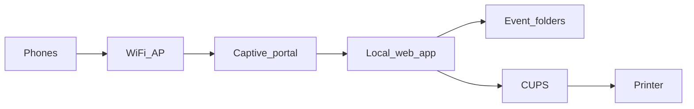

# Closed box technical model

See [[Space]] for the contract. See [[The Box]] for how the night is run.

Locked:

- **Persistence:** STTN keeps the disk. Each event is its own folder. Tonight is what phones see, unless you open a past night on purpose.
- **Leaving:** Attendee photos are view + print. Artist/DJ work is listen or view in the room. The file does not go home. A print does.

The box is not a platform. It is venue gear: PA, lights, door, this.

## The model

One machine travels with STTN. At the room it becomes the network. Phones join it and get a website that only exists here. A printer is attached to the same machine. There is no uplink.



Two content classes, one app:

- **Floor** — anyone on the network uploads photos from the camera roll. Gallery of *this* night. Print.
- **Artists** — a night code unlocks a drop: audio to stream, stills/flyers to view and print. Same rule: no file download.

Operator (on a staff phone or a laptop on the same network): create tonight, optionally mount a past event, kill a photo, see the printer queue.

## Why a website, not an app

The box has no internet. An App Store build cannot be the door. iOS and Android already know this pattern: hotel Wi‑Fi, “Sign in to network,” a page appears. That page *is* STTN.

HTTP only. A real HTTPS certificate needs the public internet. A captive portal on `http://sttn.room` (DNS hijacked to the box) is the honest design.

## The phone problem

Phones hate networks with no internet. They warn, or they silently use cellular. If DNS leaks to cellular, `sttn.room` does not resolve and the room “is down.”

The box must:

- Run DHCP and DNS so every name points at itself
- Answer Apple/Google captive-portal checks so the sign-in sheet appears
- Keep the session in that sheet or in a browser tab on the local site
- Survive “Use cellular for internet” by never depending on a public domain that phones will fetch off-LAN

Local IP as fallback (printed on a card / on the box): `http://10.0.0.1`. Ugly, reliable.

You cannot stop screenshots or a determined person saving a stream from the browser. The contract is **do not offer download**, **do not expose a files folder**, serve audio as playback and images as page furniture. STTN never puts anything online; paper is the sanctioned copy. Say that plainly at the portal. Do not pretend the box can police a camera.

## Hardware

Minimum viable night:

- **The box:** small x86 (Intel NUC-class) over a Pi if many phones will stream audio and print at once. Disk with room to accumulate events. Disk encryption, so a stolen box is not an open archive.
- **Radio:** USB AP or a travel router in AP mode, box on Ethernet behind it. Easier than making one device do radio + app + CUPS well. 5 GHz if the room allows it.
- **No uplink:** WAN unplugged. Firewall: no forward, no NAT. A single visible lamp or OS status: closed.
- **Printer:** CUPS talks USB or LAN. For “photo from phone, object in hand,” a 4×6 dye-sub event printer is the thing that actually works at 1 a.m. A photocopier is on-brand and a worse computer peripheral. Dye-sub for v1; zine/A4 as a second station later if the object should feel Human.

## Software (v1)

- Linux. `hostapd` or the travel router for Wi‑Fi. `dnsmasq` for DHCP/DNS. Captive-portal redirect.
- `nginx` (or Caddy) + one small app (Python or Node) for upload, gallery, artist drop, print jobs.
- **HEIC → JPEG** on ingest. iPhones will upload HEIC; the printer and other phones will not thank you.
- Resize on ingest. Full sensor dumps will fill the disk and the radio.
- **Audio:** compressed only (mp3/aac), cap length and bitrate. WAV on a crowded AP will melt the night. HTML5 `<audio>`, no zip of the set.
- **CUPS** + a print queue the operator can see.
- Layout on disk:

```
/data/events/2026-08-27-venue/
  photos/
  artists/<id>/audio
  artists/<id>/stills
  meta.json
```

Tonight is the only event the public app mounts. Operator can attach another folder read-only (“open a past night”).

## Night flow

1. Box on, WAN dark, SSID up (name TBD — not “STTN-Guest”).
2. Operator starts **tonight**.
3. Door: SSID + short URL/IP on a card. Artists get a second code for the drop.
4. Phones: portal → floor (upload / look / print) or artists (listen / look / print stills).
5. Print jobs hit the physical station. Someone has to unjam it. That is a role, not an edge case.
6. Pack-out: power off. Disk stays with STTN. Next event, new folder. Old nights exist but are closed until you open one.

## Defaults

- Artist gate: one night code, not accounts.
- Floor is a shared wall of tonight, not private lockers.
- No ranking, no likes.
- Operator can delete. No public comments.

## Still true

Phones can screenshot. Audio can be captured. The closed box guarantees **STTN** does not leak, train, or advertise. It does not guarantee a saint in the room. The brand promise is about the institution and the paper, not DRM.
